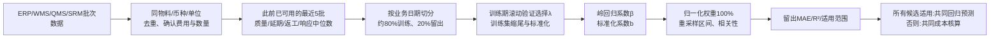

# TOC多指标权重：计算、采集与验收

入口：采购业务 → 询价项目 → 定标 → TOC分析定标 → **TOC核心：指标系数、影响权重与验证**。
“生成并查看权重演示”建立独立的240批模拟反馈，不覆盖真实数据，也不用于正式定标。

## 1. 三种数值不能混用

| 数值 | 含义 | 是否合计为1 |
|---|---|---|
| 费用核算项 | 货款、物流、返工、延期、其他费用减退款，均为货币金额 | 不需要，直接加减实际金额 |
| 原始回归系数 β | 某指标增加1原始单位时，模型预测成本的变化（其他指标固定） | 不需要，保留正负号 |
| 归一化影响权重 w | 标准化系数绝对值占比，用于本模型的影响程度解释 | 是，模型有效时合计100% |

旧实现只有“单价→实际单位综合成本”的一元诊断曲线。费用公式中直接相加不是“所有指标权重均为1”。新实现补充五指标模型，并保留成本明细核算作为透明的回退依据。

目标 **y = (含税货款 + 物流 + 返工 + 延期 + 其他 − 退款) / 合格交付数量**，单位为当前币种/合格单位。它不是纯市场报价；所得权重不代表市场报价的因果影响。

## 2. 数据到权重

| 输入指标 | 原始采集 | 单位与处理 |
|---|---|---|
| 含税到货单价 | unit_price、tax_rate、logistics_cost、received_quantity | 单价×(1+税率)+物流/收货量 |
| 历史不合格率 | accepted_quantity、inspected_quantity | 100−合格/检验×100，百分点 |
| 历史延期率 | on_time_quantity、received_quantity | 100−准时/收货×100，百分点 |
| 历史返工率 | rework_quantity、inspected_quantity | 返工/检验×100，百分点 |
| 历史服务响应 | response_hours | 小时；请求到首次有效回复 |

后四项取**当前批次之前**、指标已实际可用的最近5批中位数，至少3批；同日批次不能用来预测彼此。供应商按编码隔离历史，模型在同物料供应商间合并训练，使用相同系数进行比较。

基础字段：供应商编码、物料编码、业务批次ID、业务日期、币种、单位。费用字段需关联实际凭证；物流、返工不能在其他费用中重复记账。`metrics_available_date` 保存全部表现指标实际可用日期，不早于业务日期；缺少该日期的老数据只允许诊断，不允许回归定标。生产还应保留各字段源凭证和更精确的可用时间以复核迟到数据。

## 3. 清洗与训练规则

- 按来源系统+供应商+业务批次ID去重，跨系统同一批次需在接入映射中统一来源与ID；保留拒绝原因计数。每物料最多读取最新5000条，不能将不同单位或币种强行换算混合。
- 缺失不补0；缺少完整历史指标窗口、未完成整批检验、未确认费用的行不作为训练目标。
- 合格数为0时单位合格成本无定义，单独记录风险，不把成本填0。近期出现零合格交付的供应商不进行报价预测。
- 至少60个可建模批次、10个业务日期；时间留出后至少40条训练、10条验证。这是系统起始门槛，不是“足够样本”的统计保证。
- 最后约20%业务日期为留出集，同日数据不可跨集合。训练期内部按50%/65%/80%滚动边界选择λ∈{0.1,1,10,100}，取MAE最小者。
- 每次训练只使用该训练子集拟合P1/P99输入缩尾、均值μ、标准差σ；留出集沿用训练参数。目标成本保留原值；原始数据不被覆盖。

模型：`zⱼ=(clip(xⱼ,P1ⱼ,P99ⱼ)−μⱼ)/σⱼ`。

最小化 `Σ(yᵢ−α−Σbⱼzᵢⱼ)² + λΣbⱼ²`，截距不惩罚。

原始系数 `βⱼ=bⱼ/σⱼ`；原始截距 `β₀=α−Σβⱼμⱼ`。

**权重 `wⱼ=|bⱼ|/Σ|bₖ|`**。系数总幅度为0时不强行分配平均权重。系数描述训练缩尾适用范围内的局部关系；负号不能被权重图替代。

## 4. 解释和模型有效性

界面展示权重饼图、原始系数柱图、权重表、训练参数、业务日期成组bootstrap稳定区间、输入相关性热图、单指标敏感性曲线、实际/预测散点与残差图、验证原始批次表。

- 60次按日期成组重采样，在固定已选λ下给出权重2.5%与97.5%分位数。它是有限重复次数的稳定性诊断，不是因果推断，也不能代替正式置信区间研究。
- 留出集逐指标置换20次，显示MAE增量。负值或零表示没有支持其独立留出贡献；相关特征会导致解释偏差，不据此自动删字段。
- 恒定指标无法识别；任意两指标绝对相关系数≥0.9，模型需要复核并禁止回归定标。岭回归缓解数值问题，但不能凭正则化证明系数有可靠因果意义。
- 留出MAE须优于训练目标中位数基线，R²须>0，预测不得为负。需要持续监测时间漂移；系统只在当前数据通过时输出适用判断。
- 正态性检验针对残差，自变量不必正态。Shapiro p值既不证明正态，也不单独决定模型业务有效性；结合残差的趋势、异方差、异常点判断。
- 报价预测使用当前含税到货单价与最近已可用历史指标；任何指标超出训练P1/P99适用区间时停止外推。时间留出模型不在展示前偷偷用留出数据重训。

同一物料的所有有效回标均有可用预测时，整组采用回归成本；否则整组使用历史成本核算。界面逐物料显示方法与不适用原因，审计快照包含模型版本、指纹、系数、数据处理及验证结果。真实定标重新加载数据并排除模拟样本。

## 5. 模拟示例的含义

权重演示以独立随机指标和已知滞后关系构造，用于检查程序能恢复不同系数，不用于声称真实业务效果。240原始批次中，前3批/供应商用于历史初始化，得到231个可建模样本。权重随样本而定，不能把演示权重作为企业默认参数。

## 参考依据

- [NIST线性最小二乘回归](https://www.itl.nist.gov/div898/handbook/pmd/section1/pmd141.htm)
- [NIST回归诊断：误差、残差与多重共线性](https://www.itl.nist.gov/div898/software/dataplot/refman1/auxillar/regrdiag.htm)
- [NIST标准化系数说明](https://itl.nist.gov/div898/software/dataplot/refman1/ch3/line_fit.htm)
- [scikit-learn留出集置换重要性及相关特征限制](https://scikit-learn.org/stable/modules/permutation_importance.html)
